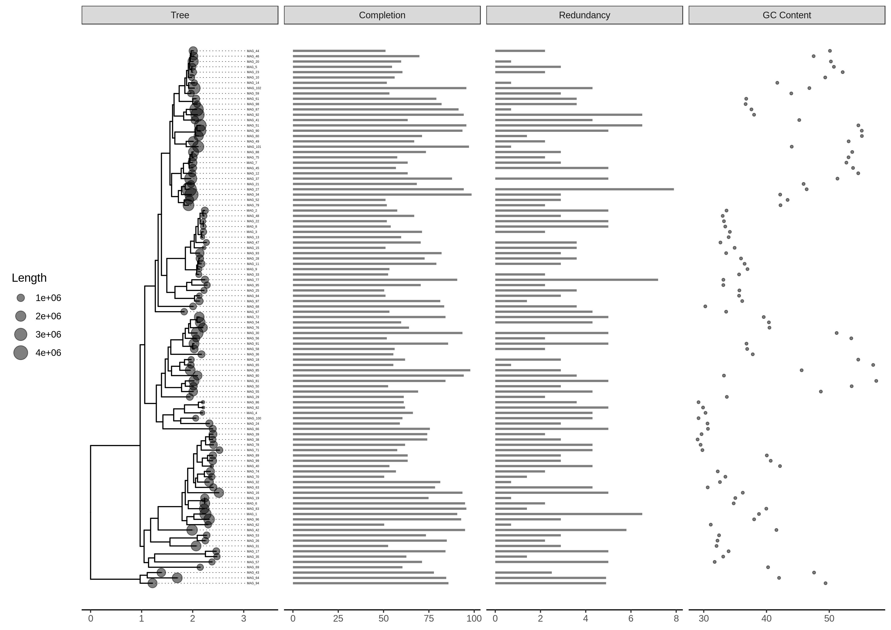

MAGstats - Visualizing the completeness and redundancy of MAGs and draft genomes
===
filename: README.md

## Quick Start

 - Launch the binder with the button above. This will take a few minutes to load.
 - Upload your newick tree and metadata file to the `example_data` folder via the `upload` button.
 - Launch the R Jupyter notebook by clicking `index.ipynb`
 - Change the necessary file names
 	```r
	nwk_file <- "GToTree_output.newick"
	bin_metadata_file <- "MED_metadata.tsv"
	```
 - Execute the code blocks to generate the final figure

## Example Output

 - 

## Summary

 - Designed to visualize various quality metrics for MAGs and draft genomes
 - The immediate input for MAGstats are a newick tree file and a metadatafile
 	- A newick tree file can be generated using [GToTree](https://github.com/AstrobioMike/GToTree)
 	- A metadata file can be generated using the `qa` option in [CheckM](https://github.com/Ecogenomics/CheckM)
 		- MAGstats only requires five columns from the CheckM output with the names `MAG_ID	Length	Completion	Redundancy	GC_Content`
 		- Column names must exactly match these five in a tab-delimited format
 		- Necessary columns can be selected in Excel and exported as a TSV
 - The output displays the phylogenetic tree of MAGs and genomes with corresponding quality information. MAGstats can be used to explore the quality of a set of MAGs and/or genomes for downstream analysis 

## Authors

 - Shengwei Hou, housw, 0000-0002-4474-7443

## Links

Zenodo Binder, doi: [](https://doi.org/10.5281/zenodo.2780512)

Github Binder: [](https://mybinder.org/v2/gh/speeding-up-science-workshops/MAGstats-binder/master)

Github Repository: https://github.com/speeding-up-science-workshops/MAGstats-binder/
